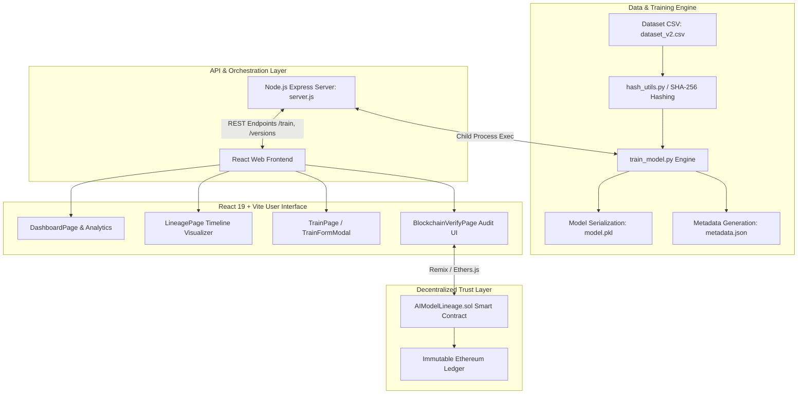

# Complete End-to-End Workflow & Exhaustive File Documentation
## AI Model Lineage & Blockchain Tracker

---

## Executive Summary

The **AI Model Lineage & Blockchain Tracker** is an enterprise-grade platform designed to bring **transparency, auditability, data integrity, and version control** to Machine Learning (ML) lifecycles. By combining **Python-based ML model training**, **SHA-256 cryptographic dataset hashing**, a **Node.js Express REST API backend**, a **React + Vite web frontend**, and an **Ethereum Solidity Smart Contract**, the platform ensures that every trained model version is immutably linked to the exact code, dataset state, and performance metrics used during its creation.

---

## 1. High-Level Architecture Diagram



---

## 2. End-to-End Complete Workflow

The platform operates through a seamless 7-phase execution pipeline:

```
[Dataset Update] ──> [SHA-256 Hashing] ──> [Model Training & Evaluation] ──> [Artifact Versioning] ──> [Express API] ──> [React UI Visualization] ──> [Blockchain Immutable Logging]
```

### Phase 1: Dataset Ingestion & Cryptographic Hashing
1. Training data resides in `ai-model-lineage-tracker/dataset/dataset_v2.csv`.
2. Prior to training, the streaming hash function (`generate_dataset_hash`) reads `dataset_v2.csv` in **8KB chunks** using Python’s `hashlib.sha256`.
3. A unique **64-character SHA-256 hex string** is computed. Any modification to a single row, character, or comma in the CSV alters this hash completely.

### Phase 2: Machine Learning Model Training & Evaluation
1. The training engine (`train_model.py`) loads the requested model algorithm (`logistic-regression`, `decision-tree`, `random-forest`, or `svm`).
2. Feature variables ($X$) and target labels ($y$) are extracted from `dataset_v2.csv`.
3. `scikit-learn` fits the model on the features and generates predictions ($\hat{y}$).
4. Quantitative performance metrics are calculated:
   - **Accuracy**: $\frac{TP + TN}{TP + TN + FP + FN}$
   - **Precision**: $\frac{TP}{TP + FP}$
   - **Recall**: $\frac{TP}{TP + FN}$

### Phase 3: Automated Versioning & Artifact Serialization
1. The engine inspects `ai_model/model_versions/<model_id>/` for existing version directories (`v1`, `v2`, ...).
2. It auto-increments to the next version number (e.g., `v62`).
3. The trained ML model object is serialized to binary format using `joblib` as `model.pkl`.
4. Structured lineage metadata is serialized into `metadata.json`:
   - Model parameters (`model_id`, `version_id`, `model_type`)
   - Evaluation metrics (`accuracy`, `precision`, `recall`)
   - Execution details (`training_time`, `previous_version`)
   - Cryptographic proof (`dataset_name`, `dataset_hash`)
   - Audit notes (`experiment_note`, `code_change_summary`, `code_snippet`)

### Phase 4: Express REST API Orchestration
1. A user triggers model training via the React Web UI or desktop app.
2. The Node.js Express server (`server.js`) handles `POST /train/:modelId`.
3. It writes experiment parameters into `temp_experiment.json` and executes `python train_model.py` via `child_process.exec`.
4. Upon completion, `temp_experiment.json` is cleaned up and the JSON response is delivered back to the client.
5. `GET /versions/:modelId` scans version folders and delivers the entire lineage history as a JSON array.

### Phase 5: React Web UI Visualization & Comparative Analytics
1. The React SPA fetches lineage histories via Axios (`frontend/src/services/api.js`).
2. **DashboardPage**: Displays global statistics, performance charts, and recent version badges.
3. **LineagePage**: Renders an interactive DAG/timeline visualizer linking parent and child versions.
4. **ComparePage**: Performs side-by-side diffing of metrics, code changes, and dataset hashes between any two selected versions.
5. **TrainPage**: Provides an interactive form interface for training new versions with code change tracking.

### Phase 6: Immutable Blockchain Registration
1. To guarantee tamper-proof lineage, model metadata is registered on the Ethereum blockchain via `contracts/AIModelLineage.sol`.
2. The function `registerModelVersion(modelId, versionId, datasetHash)` stores an immutable `ModelVersion` struct on-chain with block timestamps and msg.sender address.
3. Inferences can also be registered on-chain via `registerInference(modelVersion, inputHash, outputHash)`.

### Phase 7: Dataset & Model Integrity Audit
1. When verifying a model version (`verify_dataset.py` or `BlockchainVerifyPage.jsx`), the current dataset file is re-hashed.
2. The newly calculated hash is compared against the stored `dataset_hash` in `metadata.json` or the blockchain ledger.
3. **Match** $\rightarrow$ Integrity verified ✅. **Mismatch** $\rightarrow$ Data tampering or dataset drift detected ❌.

---

## 3. Exhaustive Detailed File Explanation

Below is the exhaustive breakdown of **every single file** present in the codebase, categorized by module and sub-system.

```
AI-Model-Lineage-Blockchain-Tracker/
├── .gitignore
├── PROJECT_WORKFLOW_AND_DIRECTORY_DOCUMENTATION.md
│
├── ai-model-lineage-tracker/
│   ├── package.json
│   ├── package-lock.json
│   ├── README.md.txt
│   ├── requirements.txt.txt
│   ├── server.js
│   │
│   ├── ai_model/
│   │   ├── train_model.py
│   │   └── model_versions/
│   │       ├── logistic-regression/ (v1..v61 metadata.json & model.pkl)
│   │       ├── random-forest/       (v1..v3 metadata.json & model.pkl)
│   │       └── svm/                 (v1..v3 metadata.json & model.pkl)
│   │
│   ├── backend/
│   │   └── scripts/
│   │       └── migrate_metadata.py
│   │
│   ├── contracts/
│   │   └── AIModelLineage.sol
│   │
│   ├── dataset/
│   │   ├── dataset_v1.csv
│   │   └── dataset_v2.csv
│   │
│   ├── hashing/
│   │   ├── hash_utils.py
│   │   └── verify_dataset.py
│   │
│   └── ui/
│       ├── dashboard.py
│       └── version_tracker_app.py
│
└── frontend/
    ├── .gitignore
    ├── eslint.config.js
    ├── index.html
    ├── package.json
    ├── package-lock.json
    ├── README.md
    ├── vite.config.js
    │
    ├── public/
    │   ├── favicon.svg
    │   └── icons.svg
    │
    └── src/
        ├── main.jsx
        ├── App.jsx
        ├── index.css
        ├── App.css
        │
        ├── assets/
        │   ├── hero.png
        │   ├── react.svg
        │   └── vite.svg
        │
        ├── services/
        │   └── api.js
        │
        ├── context/
        │   ├── ModelContext.jsx
        │   └── ThemeContext.jsx
        │
        ├── utils/
        │   ├── formatters.js
        │   ├── modelMeta.js
        │   └── versionBadges.js
        │
        ├── pages/
        │   ├── PlatformSelectorPage.jsx
        │   ├── LandingPage.jsx
        │   ├── AIModelsPage.jsx
        │   ├── ModelsPage.jsx
        │   ├── DashboardPage.jsx
        │   ├── VersionsPage.jsx
        │   ├── VersionDetailPage.jsx
        │   ├── LineagePage.jsx
        │   ├── ComparePage.jsx
        │   ├── AnalyticsPage.jsx
        │   ├── TrainPage.jsx
        │   ├── BlockchainPage.jsx
        │   └── BlockchainVerifyPage.jsx
        │
        ├── components/
        │   ├── CodeSnippetBox.jsx
        │   ├── DetailInfoCard.jsx
        │   ├── ExperimentSection.jsx
        │   ├── Header.jsx
        │   ├── InfoBox.jsx
        │   ├── LineageTimeline.jsx
        │   ├── MetricLineChart.jsx
        │   ├── PageHeader.jsx
        │   ├── ScrollToTop.jsx
        │   ├── SearchBar.jsx
        │   ├── SectionCard.jsx
        │   ├── Sidebar.jsx
        │   ├── SortSelect.jsx
        │   ├── TopBar.jsx
        │   ├── TrainButton.jsx
        │   ├── TrainFormModal.jsx
        │   ├── VersionBadge.jsx
        │   ├── VersionCard.jsx
        │   ├── VersionComparison.jsx
        │   ├── VersionModal.jsx
        │   └── VersionPreviewCard.jsx
        │
        ├── components/dashboard/
        │   ├── api.js
        │   ├── RecentVersionCard.jsx
        │   └── StatCard.jsx
        │
        └── components/layout/
            ├── PageHeader.jsx
            ├── Sidebar.jsx
            └── SidebarLayout.jsx
```

---

### 3.1 Root Repository Files

* **[.gitignore](file:///c:/Users/Ms.%20Aditi/OneDrive/Desktop/ImpAditiStuff/Blockchain/AI-Model-Lineage-Blockchain-Tracker/.gitignore)**
  * **Role**: Version control exclusion list for the root workspace.
  * **Details**: Ignores `node_modules`, `.venv`, `.idea`, build artifacts, temporary JSON files, and system cache files to prevent dirty commits.

---

### 3.2 Backend Server & Core Training Engine (`ai-model-lineage-tracker/`)

* **[server.js](file:///c:/Users/Ms.%20Aditi/OneDrive/Desktop/ImpAditiStuff/Blockchain/AI-Model-Lineage-Blockchain-Tracker/ai-model-lineage-tracker/server.js)**
  * **Role**: Node.js Express HTTP Web API Server listening on port `5000`.
  * **Details**:
    * Configures CORS middleware for frontend communication.
    * `POST /train/:modelId`: Writes experiment parameters (`experiment_note`, `code_change_summary`, `code_snippet`) to `temp_experiment.json` and executes `python ai_model/train_model.py` via Node's `child_process.exec`.
    * `GET /versions/:modelId`: Reads all version subdirectories inside `ai_model/model_versions/<modelId>`, extracts `metadata.json` files, sorts them numerically by version number, and returns a JSON list.
    * `GET /version/:modelId/:versionId`: Fetches detailed `metadata.json` for a specific version.

* **[train_model.py](file:///c:/Users/Ms.%20Aditi/OneDrive/Desktop/ImpAditiStuff/Blockchain/AI-Model-Lineage-Blockchain-Tracker/ai-model-lineage-tracker/ai_model/train_model.py)**
  * **Role**: Core Python Machine Learning pipeline and versioning engine.
  * **Details**:
    * Supports multiple Scikit-Learn models: `LogisticRegression`, `DecisionTreeClassifier`, `RandomForestClassifier`, `SVC`.
    * Loads data from `dataset/dataset_v2.csv`.
    * Computes SHA-256 checksum of the dataset in 8192-byte chunks.
    * Trains the classifier and evaluates `accuracy_score`, `precision_score`, and `recall_score`.
    * Scans `ai_model/model_versions/<model_id>/` to compute the next incremental version string (e.g., `v1` $\rightarrow$ `v2` $\rightarrow$ `v62`).
    * Serializes model weights to `model.pkl` via `joblib.dump()`.
    * Writes comprehensive JSON metadata to `metadata.json`.

* **[package.json](file:///c:/Users/Ms.%20Aditi/OneDrive/Desktop/ImpAditiStuff/Blockchain/AI-Model-Lineage-Blockchain-Tracker/ai-model-lineage-tracker/package.json)** & **[package-lock.json](file:///c:/Users/Ms.%20Aditi/OneDrive/Desktop/ImpAditiStuff/Blockchain/AI-Model-Lineage-Blockchain-Tracker/ai-model-lineage-tracker/package-lock.json)**
  * **Role**: Node.js package manifest and dependency lockfile for the backend server.
  * **Details**: Defines start scripts and specifies dependencies (`express`, `cors`).

* **[requirements.txt.txt](file:///c:/Users/Ms.%20Aditi/OneDrive/Desktop/ImpAditiStuff/Blockchain/AI-Model-Lineage-Blockchain-Tracker/ai-model-lineage-tracker/requirements.txt.txt)**
  * **Role**: Python package dependency declaration.
  * **Details**: Lists necessary Python packages (`pandas`, `scikit-learn`, `joblib`).

* **[README.md.txt](file:///c:/Users/Ms.%20Aditi/OneDrive/Desktop/ImpAditiStuff/Blockchain/AI-Model-Lineage-Blockchain-Tracker/ai-model-lineage-tracker/README.md.txt)**
  * **Role**: Tracker backend documentation file.

---

### 3.3 Hashing & Verification Engine (`ai-model-lineage-tracker/hashing/`)

* **[hash_utils.py](file:///c:/Users/Ms.%20Aditi/OneDrive/Desktop/ImpAditiStuff/Blockchain/AI-Model-Lineage-Blockchain-Tracker/ai-model-lineage-tracker/hashing/hash_utils.py)**
  * **Role**: Reusable cryptographic hashing module.
  * **Details**: Contains `generate_file_hash(file_path)` which streams any file through `hashlib.sha256()` in 4096-byte chunks to generate a deterministic 256-bit hexadecimal string.

* **[verify_dataset.py](file:///c:/Users/Ms.%20Aditi/OneDrive/Desktop/ImpAditiStuff/Blockchain/AI-Model-Lineage-Blockchain-Tracker/ai-model-lineage-tracker/hashing/verify_dataset.py)**
  * **Role**: Independent dataset integrity verification and audit script.
  * **Details**: Reads saved `dataset_hash` from a version's `metadata.json`, recomputes the SHA-256 hash of `dataset_v2.csv`, and prints whether dataset integrity is intact or violated.

---

### 3.4 Backend Maintenance Scripts (`ai-model-lineage-tracker/backend/scripts/`)

* **[migrate_metadata.py](file:///c:/Users/Ms.%20Aditi/OneDrive/Desktop/ImpAditiStuff/Blockchain/AI-Model-Lineage-Blockchain-Tracker/ai-model-lineage-tracker/backend/scripts/migrate_metadata.py)**
  * **Role**: Database/Metadata schema migration tool.
  * **Details**: Iterates across all stored model version directories (`logistic-regression`, `random-forest`, `svm`), checks existing `metadata.json` files for missing `dataset_name` or `dataset_hash` fields, and injects them automatically.

---

### 3.5 Smart Contracts (`ai-model-lineage-tracker/contracts/`)

* **[AIModelLineage.sol](file:///c:/Users/Ms.%20Aditi/OneDrive/Desktop/ImpAditiStuff/Blockchain/AI-Model-Lineage-Blockchain-Tracker/ai-model-lineage-tracker/contracts/AIModelLineage.sol)**
  * **Role**: Solidity 0.8.0 Smart Contract deployed on Ethereum / Remix EVM.
  * **Details**:
    * `owner`: Restricts registration capabilities to authorized deployers (`onlyOwner`).
    * `ModelVersion` struct: Stores `modelId`, `versionId`, `datasetHash`, `timestamp`, and `registeredBy`.
    * `InferenceRecord` struct: Stores `modelVersion`, `inputHash`, `outputHash`, and `timestamp`.
    * `registerModelVersion()`: Writes a new model version record onto the blockchain ledger using key format `modelId_versionId`.
    * `getModelVersion()`: Queries on-chain lineage record for verification.
    * `registerInference()` & `getInferenceRecord()`: Logs and audits model inference events on-chain.

---

### 3.6 Datasets & Serialized Model Storage (`ai-model-lineage-tracker/dataset/` & `ai_model/model_versions/`)

* **[dataset_v1.csv](file:///c:/Users/Ms.%20Aditi/OneDrive/Desktop/ImpAditiStuff/Blockchain/AI-Model-Lineage-Blockchain-Tracker/ai-model-lineage-tracker/dataset/dataset_v1.csv)** & **[dataset_v2.csv](file:///c:/Users/Ms.%20Aditi/OneDrive/Desktop/ImpAditiStuff/Blockchain/AI-Model-Lineage-Blockchain-Tracker/ai-model-lineage-tracker/dataset/dataset_v2.csv)**
  * **Role**: Baseline and updated training datasets containing numerical feature vectors and target classification labels (`label`).
* **`ai_model/model_versions/` Directory Tree**:
  * Contains trained model directories: `logistic-regression/`, `random-forest/`, `svm/`.
  * Each version subdirectory (`v1`, `v2`, ..., `v61`) holds:
    * `model.pkl`: Serialized Scikit-Learn binary model weights.
    * `metadata.json`: Full lineage record including metrics, code snippet, notes, timestamp, and dataset SHA-256 hash.

---

### 3.7 Legacy Desktop GUI Applications (`ai-model-lineage-tracker/ui/`)

* **[dashboard.py](file:///c:/Users/Ms.%20Aditi/OneDrive/Desktop/ImpAditiStuff/Blockchain/AI-Model-Lineage-Blockchain-Tracker/ai-model-lineage-tracker/ui/dashboard.py)**
  * **Role**: Full-featured Tkinter desktop application with multi-page sidebar navigation.
  * **Details**: Includes Model Selection, Version Training, Metadata Explorer, Version Dashboard TreeView, Lineage Canvas Visualizer, and Blockchain Payload Helper.

* **[version_tracker_app.py](file:///c:/Users/Ms.%20Aditi/OneDrive/Desktop/ImpAditiStuff/Blockchain/AI-Model-Lineage-Blockchain-Tracker/ai-model-lineage-tracker/ui/version_tracker_app.py)**
  * **Role**: Single-window scrollable Tkinter desktop app for rapid model training and blockchain data formatting for Remix IDE.

---

### 3.8 Modern React Frontend Application (`frontend/`)

#### 3.8.1 Configuration & Base Setup
* **[frontend/package.json](file:///c:/Users/Ms.%20Aditi/OneDrive/Desktop/ImpAditiStuff/Blockchain/AI-Model-Lineage-Blockchain-Tracker/frontend/package.json)** & **[package-lock.json](file:///c:/Users/Ms.%20Aditi/OneDrive/Desktop/ImpAditiStuff/Blockchain/AI-Model-Lineage-Blockchain-Tracker/frontend/package-lock.json)**: React 19, React Router DOM 7, Lucide React icons, Axios, and Vite build configuration.
* **[frontend/vite.config.js](file:///c:/Users/Ms.%20Aditi/OneDrive/Desktop/ImpAditiStuff/Blockchain/AI-Model-Lineage-Blockchain-Tracker/frontend/vite.config.js)**: Vite dev server and React plugin bundler config.
* **[frontend/index.html](file:///c:/Users/Ms.%20Aditi/OneDrive/Desktop/ImpAditiStuff/Blockchain/AI-Model-Lineage-Blockchain-Tracker/frontend/index.html)**: HTML5 entry template with viewport settings and root div mount point.
* **[frontend/eslint.config.js](file:///c:/Users/Ms.%20Aditi/OneDrive/Desktop/ImpAditiStuff/Blockchain/AI-Model-Lineage-Blockchain-Tracker/frontend/eslint.config.js)**: Code linting rules for React JavaScript.
* **[frontend/.gitignore](file:///c:/Users/Ms.%20Aditi/OneDrive/Desktop/ImpAditiStuff/Blockchain/AI-Model-Lineage-Blockchain-Tracker/frontend/.gitignore)**: Excludes `node_modules` and `dist` build output.
* **[frontend/README.md](file:///c:/Users/Ms.%20Aditi/OneDrive/Desktop/ImpAditiStuff/Blockchain/AI-Model-Lineage-Blockchain-Tracker/frontend/README.md)**: Documentation for running the Vite dev server.

#### 3.8.2 Global Styling & Assets
* **[main.jsx](file:///c:/Users/Ms.%20Aditi/OneDrive/Desktop/ImpAditiStuff/Blockchain/AI-Model-Lineage-Blockchain-Tracker/frontend/src/main.jsx)**: React DOM root renderer wrapping `<App />` inside `ThemeProvider` and `ModelProvider`.
* **[App.css](file:///c:/Users/Ms.%20Aditi/OneDrive/Desktop/ImpAditiStuff/Blockchain/AI-Model-Lineage-Blockchain-Tracker/frontend/src/App.css)** & **[index.css](file:///c:/Users/Ms.%20Aditi/OneDrive/Desktop/ImpAditiStuff/Blockchain/AI-Model-Lineage-Blockchain-Tracker/frontend/src/index.css)**: Modern CSS styling suite incorporating CSS custom properties, glassmorphism, responsive CSS grid, theme variables (light/dark mode), and animation keyframes.
* **`frontend/src/assets/`**: Graphic static assets (`hero.png`, `react.svg`, `vite.svg`).

#### 3.8.3 Router & Global State Management
* **[App.jsx](file:///c:/Users/Ms.%20Aditi/OneDrive/Desktop/ImpAditiStuff/Blockchain/AI-Model-Lineage-Blockchain-Tracker/frontend/src/App.jsx)**: Router container providing dual-mode navigation paths:
  * `/ai/:modelId/*` $\rightarrow$ AI Model lineage mode.
  * `/models/:modelId/*` $\rightarrow$ Blockchain verified mode.
  * Includes code-splitting via `React.lazy()` and `Suspense`.
* **[ModelContext.jsx](file:///c:/Users/Ms.%20Aditi/OneDrive/Desktop/ImpAditiStuff/Blockchain/AI-Model-Lineage-Blockchain-Tracker/frontend/src/context/ModelContext.jsx)**: React Context storing global selected model ID state.
* **[ThemeContext.jsx](file:///c:/Users/Ms.%20Aditi/OneDrive/Desktop/ImpAditiStuff/Blockchain/AI-Model-Lineage-Blockchain-Tracker/frontend/src/context/ThemeContext.jsx)**: React Context managing light/dark mode preference persisted in `localStorage`.

#### 3.8.4 API Services & Utility Helpers
* **[services/api.js](file:///c:/Users/Ms.%20Aditi/OneDrive/Desktop/ImpAditiStuff/Blockchain/AI-Model-Lineage-Blockchain-Tracker/frontend/src/services/api.js)**: Axios REST client providing functions `getVersions()`, `trainModel()`, and `getVersionById()`.
* **[components/dashboard/api.js](file:///c:/Users/Ms.%20Aditi/OneDrive/Desktop/ImpAditiStuff/Blockchain/AI-Model-Lineage-Blockchain-Tracker/frontend/src/components/dashboard/api.js)**: Dashboard-specific API helper wrappers.
* **[formatters.js](file:///c:/Users/Ms.%20Aditi/OneDrive/Desktop/ImpAditiStuff/Blockchain/AI-Model-Lineage-Blockchain-Tracker/frontend/src/utils/formatters.js)**: Value formatting functions for metrics (4 decimal places) and ISO timestamps.
* **[modelMeta.js](file:///c:/Users/Ms.%20Aditi/OneDrive/Desktop/ImpAditiStuff/Blockchain/AI-Model-Lineage-Blockchain-Tracker/frontend/src/utils/modelMeta.js)**: Metadata dictionary mapping model IDs to names, short badges, categories, and descriptions.
* **[versionBadges.js](file:///c:/Users/Ms.%20Aditi/OneDrive/Desktop/ImpAditiStuff/Blockchain/AI-Model-Lineage-Blockchain-Tracker/frontend/src/utils/versionBadges.js)**: Dynamic badge generator evaluating metric thresholds to assign status tags ("Production Ready", "Verified", "High Intelligence", "Learning Phase").

#### 3.8.5 Page Component Views (`frontend/src/pages/`)
* **[PlatformSelectorPage.jsx](file:///c:/Users/Ms.%20Aditi/OneDrive/Desktop/ImpAditiStuff/Blockchain/AI-Model-Lineage-Blockchain-Tracker/frontend/src/pages/PlatformSelectorPage.jsx)**: Landing gateway allowing users to choose between the **AI Model Suite** and **Blockchain Verification System**.
* **[LandingPage.jsx](file:///c:/Users/Ms.%20Aditi/OneDrive/Desktop/ImpAditiStuff/Blockchain/AI-Model-Lineage-Blockchain-Tracker/frontend/src/pages/LandingPage.jsx)**: High-impact hero page with feature highlights and platform introduction.
* **[AIModelsPage.jsx](file:///c:/Users/Ms.%20Aditi/OneDrive/Desktop/ImpAditiStuff/Blockchain/AI-Model-Lineage-Blockchain-Tracker/frontend/src/pages/AIModelsPage.jsx)** & **[ModelsPage.jsx](file:///c:/Users/Ms.%20Aditi/OneDrive/Desktop/ImpAditiStuff/Blockchain/AI-Model-Lineage-Blockchain-Tracker/frontend/src/pages/ModelsPage.jsx)**: Model selector grids for AI and Blockchain modes.
* **[DashboardPage.jsx](file:///c:/Users/Ms.%20Aditi/OneDrive/Desktop/ImpAditiStuff/Blockchain/AI-Model-Lineage-Blockchain-Tracker/frontend/src/pages/DashboardPage.jsx)**: Overview dashboard showing version counts, metric averages, line charts, and recent versions.
* **[VersionsPage.jsx](file:///c:/Users/Ms.%20Aditi/OneDrive/Desktop/ImpAditiStuff/Blockchain/AI-Model-Lineage-Blockchain-Tracker/frontend/src/pages/VersionsPage.jsx)**: Searchable, sortable, and filterable catalog of all historical model versions with quick-action modal triggers.
* **[VersionDetailPage.jsx](file:///c:/Users/Ms.%20Aditi/OneDrive/Desktop/ImpAditiStuff/Blockchain/AI-Model-Lineage-Blockchain-Tracker/frontend/src/pages/VersionDetailPage.jsx)**: Deep-dive view of a single model version displaying metric scores, dataset hash, code snippet, experiment notes, and parent lineage link.
* **[LineagePage.jsx](file:///c:/Users/Ms.%20Aditi/OneDrive/Desktop/ImpAditiStuff/Blockchain/AI-Model-Lineage-Blockchain-Tracker/frontend/src/pages/LineagePage.jsx)**: Interactive vertical/horizontal DAG lineage tree showing the evolutionary chain across versions.
* **[ComparePage.jsx](file:///c:/Users/Ms.%20Aditi/OneDrive/Desktop/ImpAditiStuff/Blockchain/AI-Model-Lineage-Blockchain-Tracker/frontend/src/pages/ComparePage.jsx)**: Comparative analysis tool for selecting two versions and comparing metric deltas, code changes, and dataset hashes side by side.
* **[AnalyticsPage.jsx](file:///c:/Users/Ms.%20Aditi/OneDrive/Desktop/ImpAditiStuff/Blockchain/AI-Model-Lineage-Blockchain-Tracker/frontend/src/pages/AnalyticsPage.jsx)**: Advanced graphical analytics tracking accuracy, precision, and recall progression over time.
* **[TrainPage.jsx](file:///c:/Users/Ms.%20Aditi/OneDrive/Desktop/ImpAditiStuff/Blockchain/AI-Model-Lineage-Blockchain-Tracker/frontend/src/pages/TrainPage.jsx)**: Dedicated experiment room for submitting experiment notes, code change descriptions, and code snippets to train new model versions.
* **[BlockchainPage.jsx](file:///c:/Users/Ms.%20Aditi/OneDrive/Desktop/ImpAditiStuff/Blockchain/AI-Model-Lineage-Blockchain-Tracker/frontend/src/pages/BlockchainPage.jsx)** & **[BlockchainVerifyPage.jsx](file:///c:/Users/Ms.%20Aditi/OneDrive/Desktop/ImpAditiStuff/Blockchain/AI-Model-Lineage-Blockchain-Tracker/frontend/src/pages/BlockchainVerifyPage.jsx)**: Smart contract verification views to audit stored dataset hashes against on-chain records.

#### 3.8.6 Reusable UI Components (`frontend/src/components/`)
* **[Header.jsx](file:///c:/Users/Ms.%20Aditi/OneDrive/Desktop/ImpAditiStuff/Blockchain/AI-Model-Lineage-Blockchain-Tracker/frontend/src/components/Header.jsx)** & **[TopBar.jsx](file:///c:/Users/Ms.%20Aditi/OneDrive/Desktop/ImpAditiStuff/Blockchain/AI-Model-Lineage-Blockchain-Tracker/frontend/src/components/TopBar.jsx)**: Navigation header bar featuring theme switcher, model selector context, and breadcrumbs.
* **[Sidebar.jsx](file:///c:/Users/Ms.%20Aditi/OneDrive/Desktop/ImpAditiStuff/Blockchain/AI-Model-Lineage-Blockchain-Tracker/frontend/src/components/Sidebar.jsx)** (and `layout/Sidebar.jsx` & `layouts/SidebarLayout.jsx`): Collapsible left sidebar navigation menu.
* **[VersionCard.jsx](file:///c:/Users/Ms.%20Aditi/OneDrive/Desktop/ImpAditiStuff/Blockchain/AI-Model-Lineage-Blockchain-Tracker/frontend/src/components/VersionCard.jsx)** & **[VersionPreviewCard.jsx](file:///c:/Users/Ms.%20Aditi/OneDrive/Desktop/ImpAditiStuff/Blockchain/AI-Model-Lineage-Blockchain-Tracker/frontend/src/components/VersionPreviewCard.jsx)**: Card elements summarizing version performance, timestamps, and hashes.
* **[TrainFormModal.jsx](file:///c:/Users/Ms.%20Aditi/OneDrive/Desktop/ImpAditiStuff/Blockchain/AI-Model-Lineage-Blockchain-Tracker/frontend/src/components/TrainFormModal.jsx)** & **[TrainButton.jsx](file:///c:/Users/Ms.%20Aditi/OneDrive/Desktop/ImpAditiStuff/Blockchain/AI-Model-Lineage-Blockchain-Tracker/frontend/src/components/TrainButton.jsx)**: Modal dialogue and button triggers for initiating model training directly from any view.
* **[LineageTimeline.jsx](file:///c:/Users/Ms.%20Aditi/OneDrive/Desktop/ImpAditiStuff/Blockchain/AI-Model-Lineage-Blockchain-Tracker/frontend/src/components/LineageTimeline.jsx)**: Flow timeline visualizer rendering parent-child connections.
* **[MetricLineChart.jsx](file:///c:/Users/Ms.%20Aditi/OneDrive/Desktop/ImpAditiStuff/Blockchain/AI-Model-Lineage-Blockchain-Tracker/frontend/src/components/MetricLineChart.jsx)**: SVG/Canvas chart component rendering accuracy/precision/recall trend lines across version history.
* **[VersionComparison.jsx](file:///c:/Users/Ms.%20Aditi/OneDrive/Desktop/ImpAditiStuff/Blockchain/AI-Model-Lineage-Blockchain-Tracker/frontend/src/components/VersionComparison.jsx)**: Side-by-side metric comparison cards with green/red indicator badges for performance deltas.
* **[CodeSnippetBox.jsx](file:///c:/Users/Ms.%20Aditi/OneDrive/Desktop/ImpAditiStuff/Blockchain/AI-Model-Lineage-Blockchain-Tracker/frontend/src/components/CodeSnippetBox.jsx)**: Syntax-highlighted text area for reviewing code changes.
* **[DetailInfoCard.jsx](file:///c:/Users/Ms.%20Aditi/OneDrive/Desktop/ImpAditiStuff/Blockchain/AI-Model-Lineage-Blockchain-Tracker/frontend/src/components/DetailInfoCard.jsx)**, **[InfoBox.jsx](file:///c:/Users/Ms.%20Aditi/OneDrive/Desktop/ImpAditiStuff/Blockchain/AI-Model-Lineage-Blockchain-Tracker/frontend/src/components/InfoBox.jsx)**, **[SectionCard.jsx](file:///c:/Users/Ms.%20Aditi/OneDrive/Desktop/ImpAditiStuff/Blockchain/AI-Model-Lineage-Blockchain-Tracker/frontend/src/components/SectionCard.jsx)**: Structured metadata containers.
* **[SearchBar.jsx](file:///c:/Users/Ms.%20Aditi/OneDrive/Desktop/ImpAditiStuff/Blockchain/AI-Model-Lineage-Blockchain-Tracker/frontend/src/components/SearchBar.jsx)** & **[SortSelect.jsx](file:///c:/Users/Ms.%20Aditi/OneDrive/Desktop/ImpAditiStuff/Blockchain/AI-Model-Lineage-Blockchain-Tracker/frontend/src/components/SortSelect.jsx)**: Input controls for filtering and sorting version catalogs.
* **[VersionModal.jsx](file:///c:/Users/Ms.%20Aditi/OneDrive/Desktop/ImpAditiStuff/Blockchain/AI-Model-Lineage-Blockchain-Tracker/frontend/src/components/VersionModal.jsx)**: Modal display for inspecting raw version JSON.
* **[VersionBadge.jsx](file:///c:/Users/Ms.%20Aditi/OneDrive/Desktop/ImpAditiStuff/Blockchain/AI-Model-Lineage-Blockchain-Tracker/frontend/src/components/VersionBadge.jsx)**: Visual badge component for rendering status tags.
* **[ScrollToTop.jsx](file:///c:/Users/Ms.%20Aditi/OneDrive/Desktop/ImpAditiStuff/Blockchain/AI-Model-Lineage-Blockchain-Tracker/frontend/src/components/ScrollToTop.jsx)**: Utility component resetting scroll position on route changes.
* **[StatCard.jsx](file:///c:/Users/Ms.%20Aditi/OneDrive/Desktop/ImpAditiStuff/Blockchain/AI-Model-Lineage-Blockchain-Tracker/frontend/src/components/dashboard/StatCard.jsx)** & **[RecentVersionCard.jsx](file:///c:/Users/Ms.%20Aditi/OneDrive/Desktop/ImpAditiStuff/Blockchain/AI-Model-Lineage-Blockchain-Tracker/frontend/src/components/dashboard/RecentVersionCard.jsx)**: High-level analytics widgets for the main dashboard view.

---

## 4. Key Data Schemas & API Integration Matrix

### 4.1 `metadata.json` Schema
```json
{
  "model_id": "logistic-regression",
  "version_id": "v61",
  "model_type": "Logistic Regression",
  "accuracy": 0.9452,
  "precision": 0.9321,
  "recall": 0.9510,
  "training_time": "2026-03-29T13:51:00.123456",
  "previous_version": "v60",
  "dataset_name": "dataset_v2.csv",
  "dataset_hash": "a8f3b2e910c...7d4e12",
  "experiment_note": "Adjusted learning rate and feature scaling",
  "code_change_summary": "Updated regularizer penalty to L2",
  "code_snippet": "LogisticRegression(max_iter=1000, C=1.5)"
}
```

### 4.2 REST API Specification

| HTTP Method | Path | Description | Payload / Query Params |
| :--- | :--- | :--- | :--- |
| `GET` | `/` | Health check endpoint | N/A |
| `POST` | `/train/:modelId` | Triggers Python training pipeline | `{ experiment_note, code_change_summary, code_snippet }` |
| `GET` | `/versions/:modelId` | Lists all metadata records for model | N/A |
| `GET` | `/version/:modelId/:versionId` | Retrieves single version metadata | N/A |

### 4.3 Smart Contract (`AIModelLineage.sol`) Data Structures

```solidity
struct ModelVersion {
    string modelId;
    string versionId;
    string datasetHash;
    uint256 timestamp;
    address registeredBy;
}

struct InferenceRecord {
    string modelVersion;
    string inputHash;
    string outputHash;
    uint256 timestamp;
}
```

---

## Summary

This documentation provides a comprehensive, end-to-end overview of the **AI Model Lineage & Blockchain Tracker**, detailing every file, data flow, API endpoint, smart contract struct, and UI view across the entire repository.
